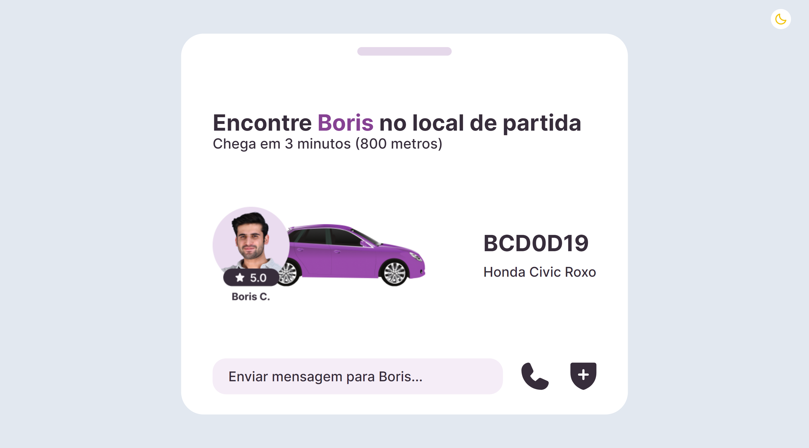

<h1 align="center"> Transport Widget </h1>

[Click here to access](https://remng.github.io/transport-widget/)

# 🚀 Technologies

This project was developed with the follow technologies:

- HTML
- Tailwind CSS
- Javascript
- Git and Github

# 💻 Project

The Transport Widget is an interface I used to test my skills with Tailwind CSS.  

Main features:

- Responsive layout (Adapted for smaller screens);
- Hover effects;
- Added a dark theme.
